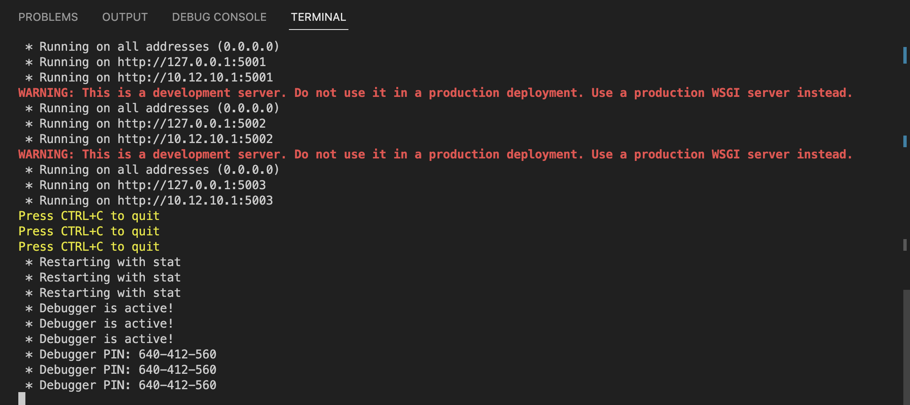
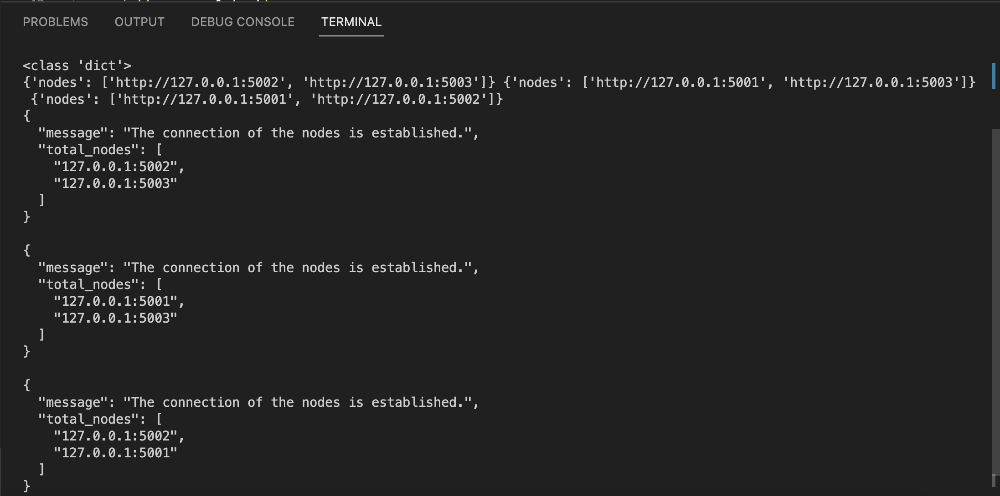
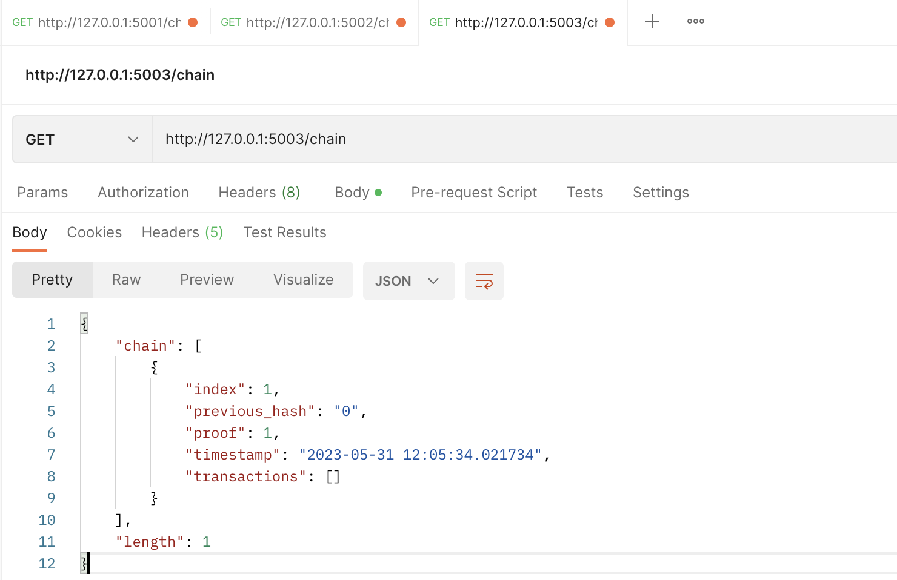
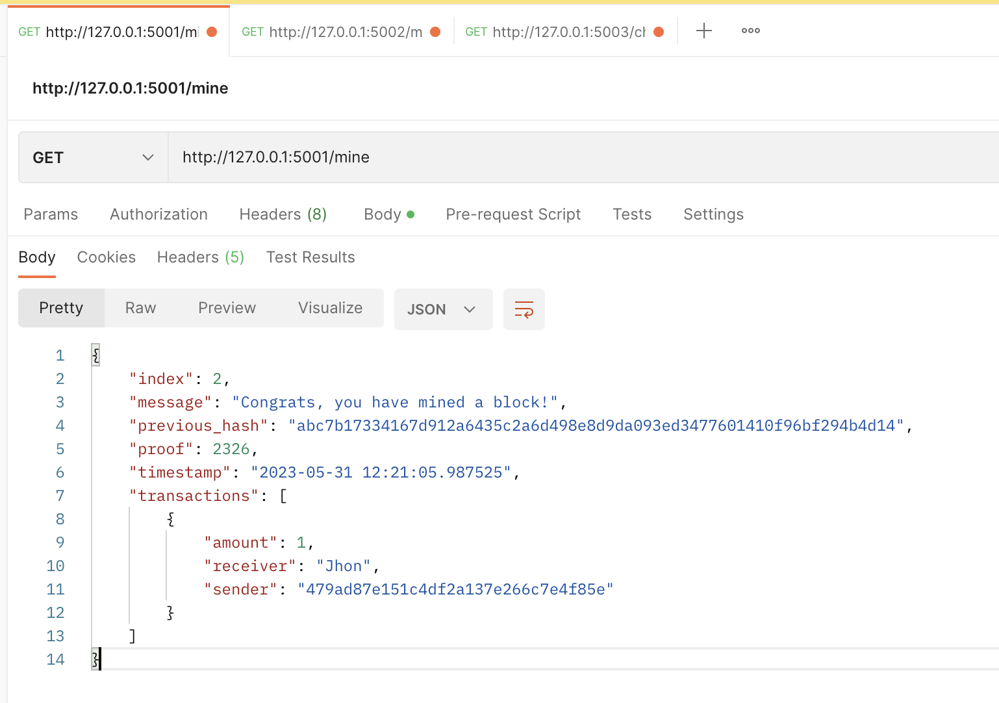
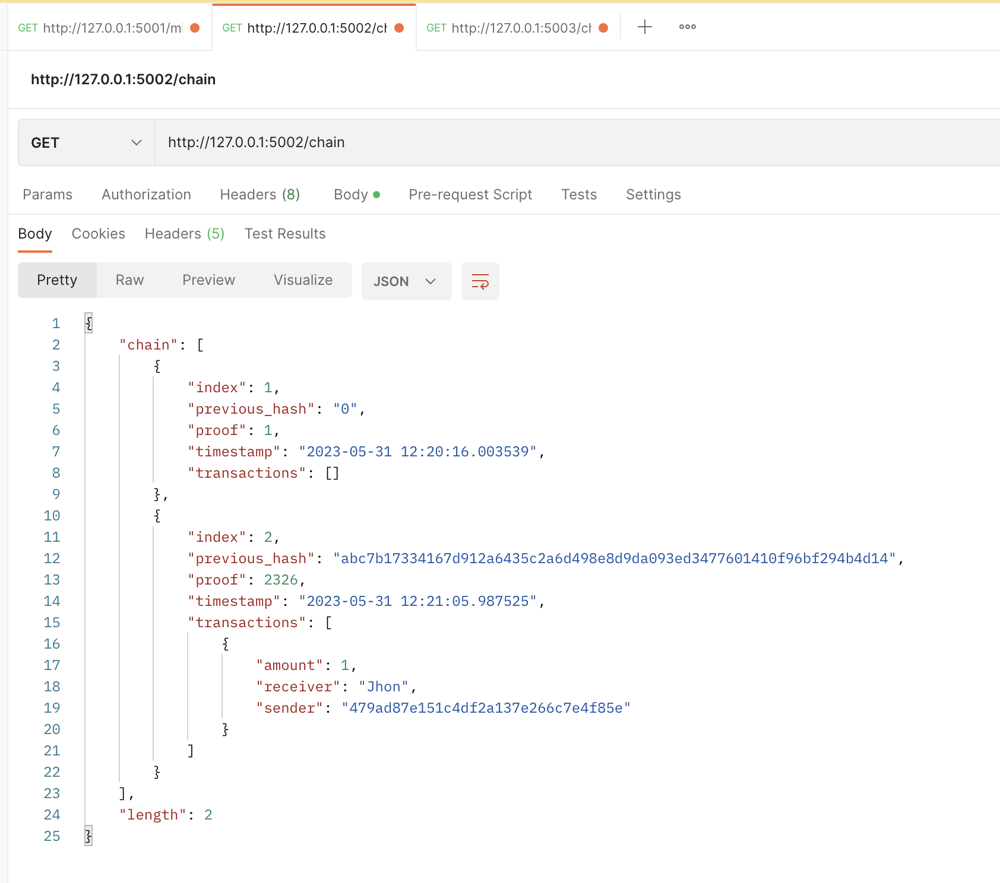
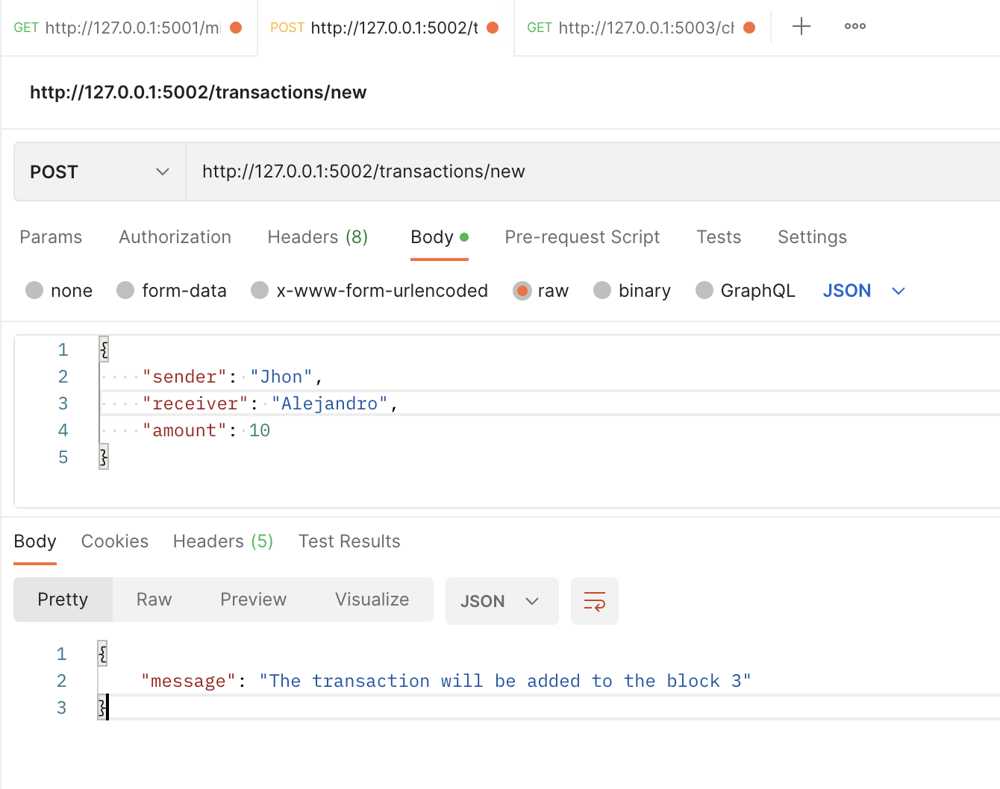
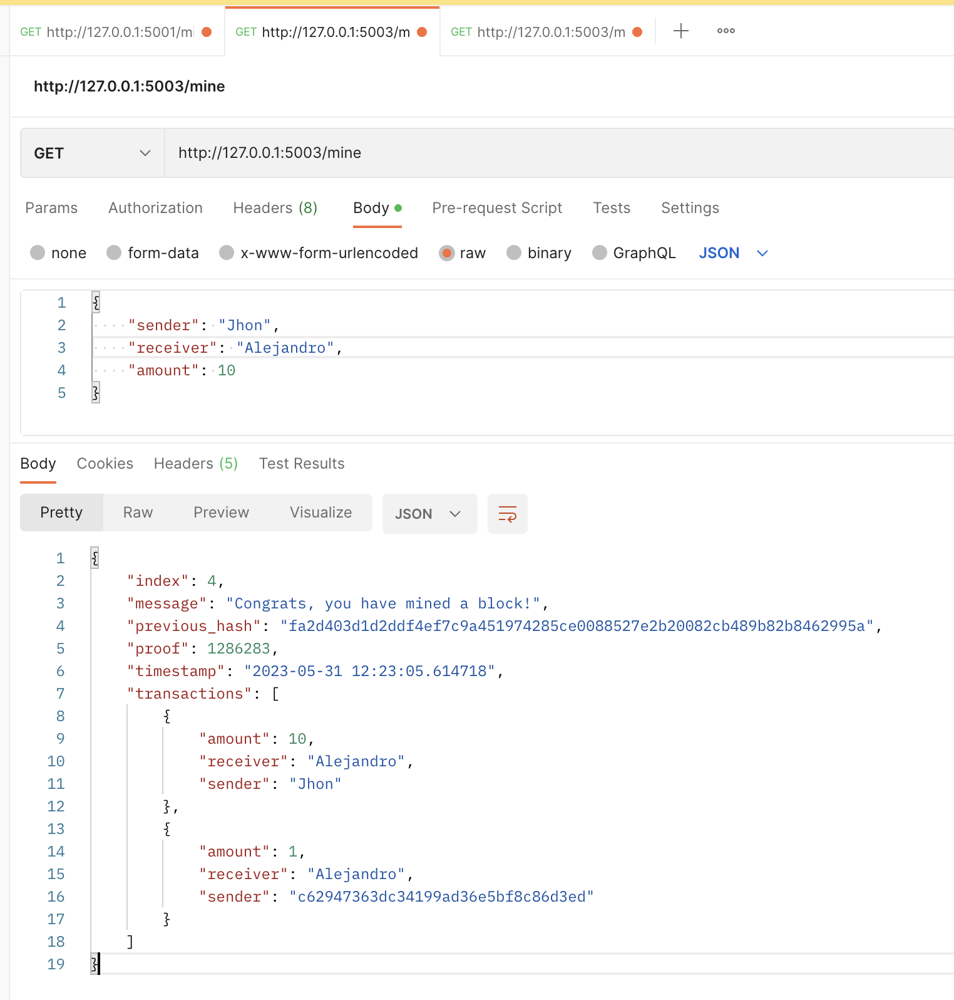
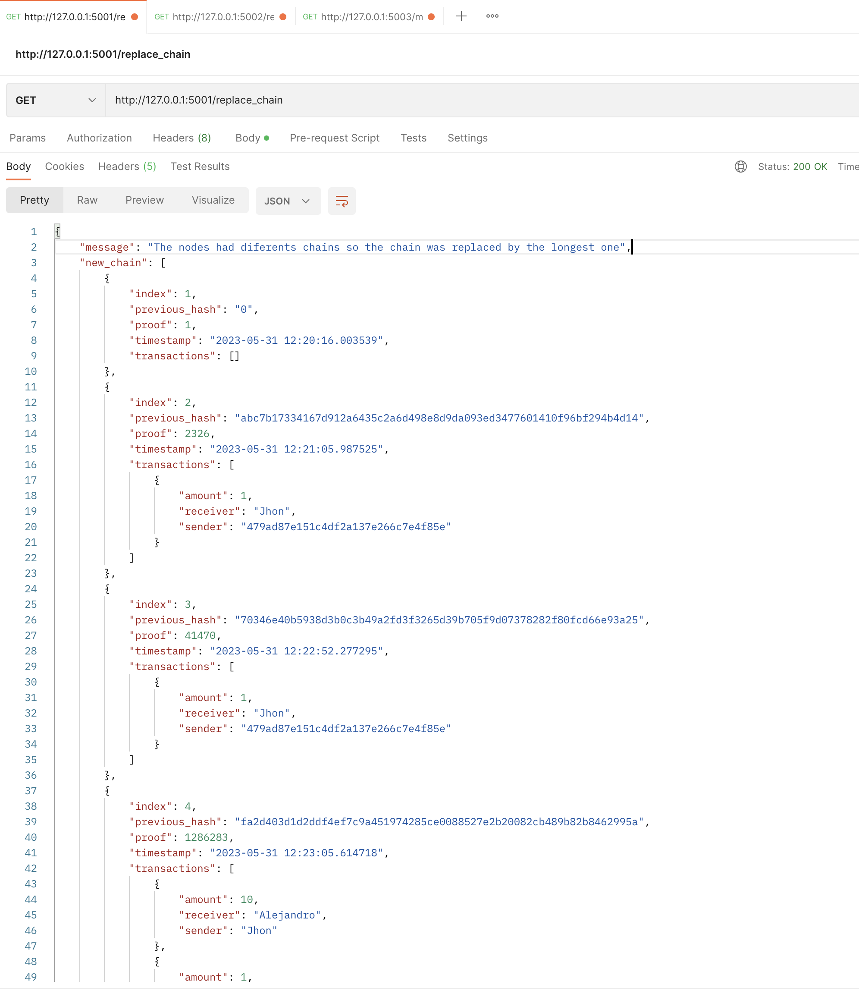

## 💰 ft_Blockchain ⛓️

## 📝 Description
The ft_Blockchain program is a simulation of creating a cryptocurrency called 42coin. This program consists of multiple nodes that act as miners and are connected to each other.

Each node can mine, display the current chain, replace the chain with the longest one, and add transactions to the next block. 

When adding a transaction, the next block that is mined by any of the nodes will display the reward for the miner and the sender. This is done using the "GET" and "POST" methods. It can be used with the "Postman" tool.

### 🛠️ Usage
Run the program 
```
python exec.py
```


Connect the nodes
```
python node_connection.py
```


Use Postman for display chain
```
http://127.0.0.1:{node}/chain
```


Mine a block
```
http://127.0.0.1:{node}/mine
```


Now, display the chain in the same or other node.
```
http://127.0.0.1:{node}/chain
```


Add transaction to the next block
```
http://127.0.0.1:{node}/transactions/new
```


Mine. You can see the reward
```
http://127.0.0.1:{node}/mine
```


Get the update chain in any block
```
http://127.0.0.1:{node}/replace_chain
```
